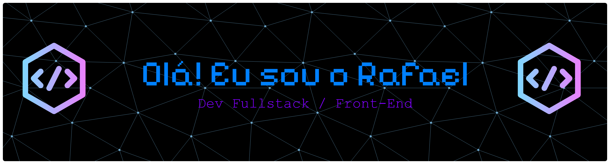

<p align="center">
  
</p>


<h1 align="center">
  Rafael A. Vettori
</h1>


<h3 align="center">
  Front-End Developer | Fullstack Developer in Progress
</h3>


<p align="center">
  Desenvolvedor em formação pela EBAC, focado na criação de aplicações web modernas,
  interfaces responsivas e experiências digitais eficientes.
</p>


<br>


<p align="center">

<a href="https://www.linkedin.com/in/rafaelarcangelovettori/">

</a>

<a href="https://www.instagram.com/vttrafael">

</a>

<a href="https://portfolio-rafa-ten.vercel.app/">

</a>

</p>


<br>


<div align="center">


</div>


<br>


## About Me


```javascript
const developer = {

    name: "Rafael Vettori",

    role: "Front-End Developer",

    education: "Full Stack Development - EBAC",


    stack: {

        frontend: [
            "HTML5",
            "CSS3",
            "JavaScript",
            "Vue.js",
            "React"
        ],


        styling: [
            "Sass",
            "Bootstrap"
        ],


        tools: [
            "Vite",
            "Node.js",
            "Git",
            "GitHub",
            "VS Code"
        ]

    },


    currentlyLearning: [
        "React",
        "TypeScript",
        "Python"
    ]

};
```


<br>


## Tech Stack


<div align="center">


</div>


<br>


## Currently Learning


<div align="center">


</div>


<br>


## GitHub Analytics


<div align="center">


</div>


<br>


## Contribution Activity


<div align="center">


</div>


<br>


## Connect


<div align="center">


<a href="https://www.linkedin.com/in/rafaelarcangelovettori/">


</a>


<a href="https://www.instagram.com/vttrafael">


</a>


<a href="https://portfolio-rafa-ten.vercel.app/">


</a>


</div>


<br>


<div align="center">

Construindo, aprendendo e evoluindo a cada dia.

</div>
